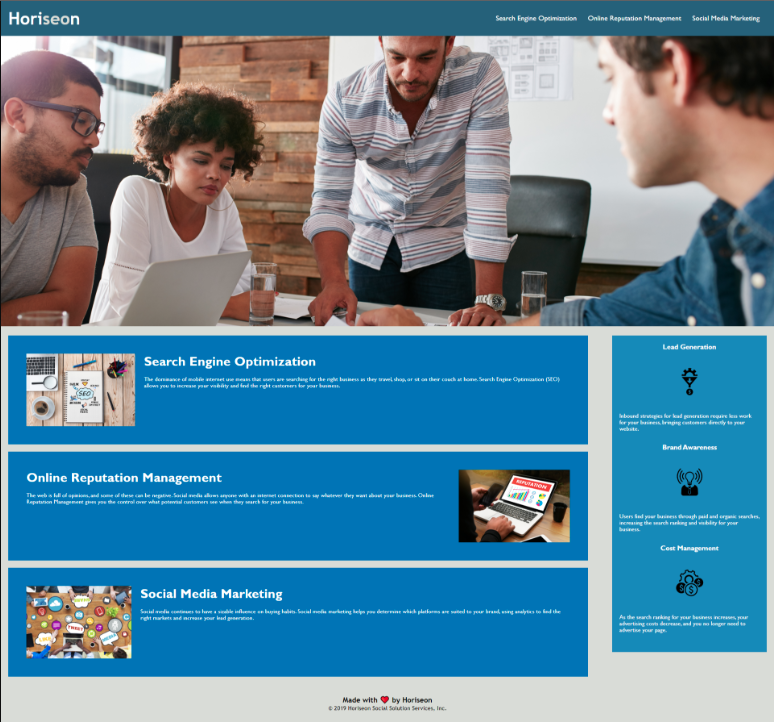

# week-one-challenge-one

## Description

This project is a code refactor for the Horiseon website homepage. The purposes of this refactoring is to make the previous code more efficient, comprehensible and accessible. This refactoring should also result in improved search engine optimization. The modification does not change the displayed styling of the page, only the underlying code.

### Tasks completed
* Classes were consolidated
* HTML elements were replaced with semantic HTML elements
* Comments were provided in the HTML document
* CSS was reorganized to follow a logical structure
* Classes and elements were separated and alphabetized
* Comments added to delineate each separation
* Title was added

### Links

[Link to the deployed website](https://regonza1993.github.io/week-one-challenge-one/)

[Link to the code repository](https://github.com/Regonza1993/week-one-challenge-one)

## Installation

Upload index.html and assets folder to the deployed webserver.  The assets folder contains images and CSS files.

The deployed website linked above was deployed using GitHub Pages.

## Usage

Once deployed the application can be viewed in a desktop web browser.  

 
